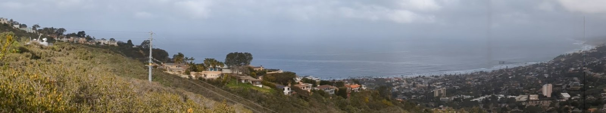

# Home

## EPCAPE

The focus of the Eastern Pacific Cloud Aerosol Precipitation Experiment (EPCAPE) is to characterize the extent, radiative properties, aerosol interactions, and precipitation characteristics of stratocumulus clouds in the Eastern Pacific across all four seasons at a coastal location, such as the Scripps Pier and the Scripps Mt. Soledad sites in La Jolla. 

This page is dedicated to host quicklooks for a portion of the NSF-funded addon EPCAPE-CCC project. The focus of EPCAPE-CCC is to explore aerosol and cloud chemistry interactions at the ancilliary Mt. Soledad site.

## System

NC State University is deploying a size-resolved CCN system that measures the particle size distribution and CCN distribution for denuded and undenuded CCN. 

## Location

The system is located inside a trailer at the Mt. Soledad site, shown on the left of the image. The DOE-AMF is located at the Scripps Pier shown toward the right of the image. 

